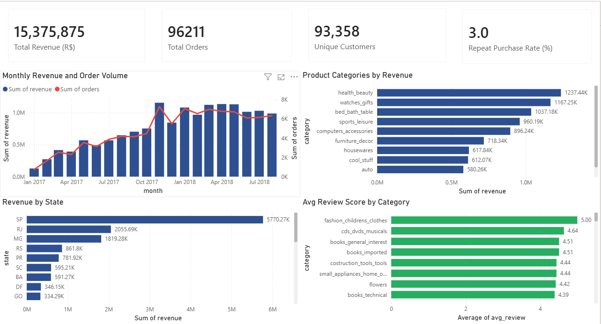
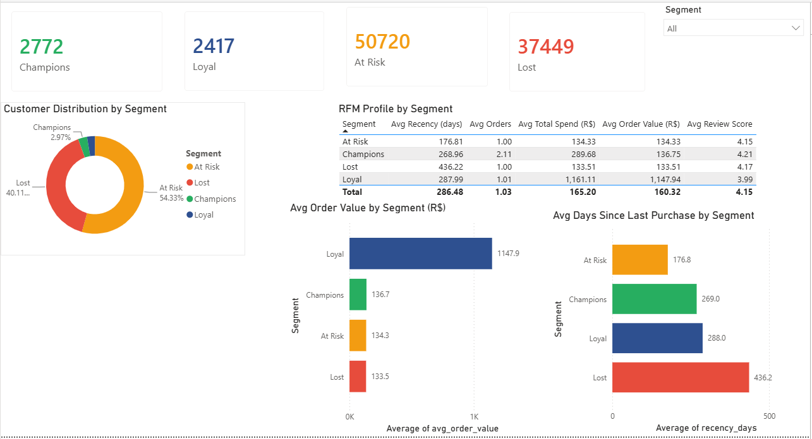
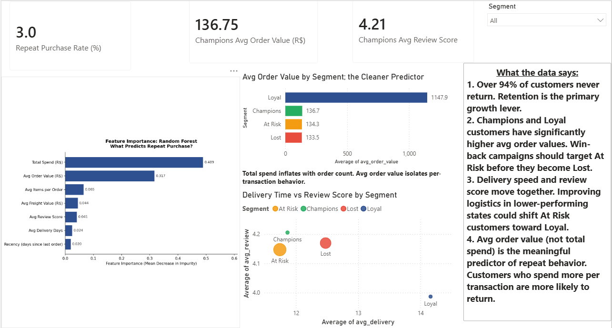

# Olist E-Commerce: Customer Segmentation and Repeat Purchase Analysis

**Which customer segments drive the most revenue, and what behavioral patterns predict whether a customer will buy again?**

This project analyzes 99,441 orders from Brazil's largest e-commerce marketplace using SQL, Python, and Power BI. It combines RFM segmentation, K-Means clustering, and a Random Forest model to identify actionable customer segments and the key drivers of repeat purchase behavior.

---

## Business Question

Which customer segments drive the most revenue on Olist, and what order-level behaviors predict whether a customer will place a second order?

---

## Dataset

**Source:** Brazilian E-Commerce Public Dataset by Olist (Kaggle)
**Coverage:** September 2016 to October 2018
**Size:** 99,441 orders across 96,096 unique customers, 9 relational tables

**Key tables used:**
- `olist_orders_dataset.csv` — order status and timestamps
- `olist_order_payments_dataset.csv` — payment values
- `olist_order_reviews_dataset.csv` — customer review scores
- `olist_order_items_dataset.csv` — items, freight, and pricing
- `olist_customers_dataset.csv` — customer geography
- `olist_products_dataset.csv` + `product_category_name_translation.csv` — product categories

### Data Handling

- Only `delivered` orders (96,478) are used for RFM segmentation and ML modeling
- 2,965 orders with missing delivery dates are retained for EDA but excluded from delivery time calculations
- RFM recency is calculated relative to 2018-10-18, the day after the last transaction in the dataset
- The full dataset covers 96,096 unique customers; after filtering to delivered orders only, the RFM table contains 93,358 customers

---

## Tools and Libraries

| Tool | Purpose |
|---|---|
| Python (pandas, numpy) | Data cleaning, RFM feature engineering |
| SQLite (via Python sqlite3) | Multi-table SQL EDA across 9 relational tables |
| scikit-learn | K-Means clustering, Random Forest, 5-fold cross-validation |
| matplotlib, seaborn | Exploratory visualization |
| SHAP | Feature importance and model explainability |
| Power BI | Interactive 3-page dashboard |

---

## Project Structure

```
Olist E-Commerce/
|-- Olist_Ecommerce_Analysis.ipynb     # Full SQL + Python EDA and ML notebook
|-- olist_customers_rfm.csv            # RFM table with segment labels (Power BI input)
|-- olist_monthly_revenue.csv          # Monthly revenue trend (Power BI input)
|-- olist_categories.csv               # Revenue and reviews by category (Power BI input)
|-- olist_states.csv                   # Revenue by state (Power BI input)
|-- shap_importance.png                # Feature importance bar chart
|-- page1_sales_overview.png           # Dashboard screenshot
|-- page2_customer_segments.png        # Dashboard screenshot
|-- page3_repeat_purchase.png          # Dashboard screenshot
|-- requirements.txt                   # Python dependencies
|-- README.md
```

---

## Analysis Summary

### SQL Exploratory Data Analysis

All EDA was performed using SQL queries on a SQLite in-memory database built from the 9 raw CSV files. Key queries covered:

- Monthly revenue and order volume trends (2017 to 2018)
- Top product categories by revenue
- Revenue concentration by Brazilian state
- Average review scores by category (min 100 reviews)
- Delivery performance distribution and on-time rate

### RFM Segmentation

Each customer was profiled using three behavioral dimensions:
- **Recency:** days since their last order relative to the dataset snapshot date
- **Frequency:** total number of orders placed
- **Monetary:** total payment value across all orders

### K-Means Clustering (k=4)

The optimal cluster count was selected using the elbow method and silhouette scores across k=2 to 8 on a 5,000-customer subsample. The silhouette score peaks at k=2 (0.73) but k=4 (0.50) was chosen to produce more actionable business segments without collapsing all churned customers into a single group.

| Segment | Customers | Avg Recency (days) | Avg Order Value (R$) | Avg Review Score |
|---|---|---|---|---|
| Champions | 2,772 | 269 | 136.75 | 4.21 |
| Loyal | 2,417 | 288 | 1,147.94 | 3.99 |
| At Risk | 50,720 | 177 | 134.33 | 4.15 |
| Lost | 37,449 | 436 | 133.51 | 4.17 |

### Feature Selection and Leakage Prevention

The following features were excluded from the Random Forest model:
- `frequency`: directly encodes the repeat buyer target
- `Cluster` and `Segment`: derived from frequency
- `customer_unique_id`: identifier with no predictive value

Note: `monetary` (total spend) is structurally correlated with frequency since more orders naturally produce higher total spend. This inflates model performance and is acknowledged in the notebook. `avg_order_value` is the more causally meaningful monetary signal.

### Random Forest + Feature Importance (5-Fold CV)

A Random Forest classifier was trained on a balanced subsample (all 2,801 repeat buyers + 3,000 randomly sampled one-time buyers) with `class_weight='balanced'` to handle the 3% repeat purchase rate.

- 5-fold stratified CV ROC-AUC: **0.998** (driven largely by total spend correlation with frequency)
- 5-fold CV F1: **0.975**

**Feature importance ranking:**
1. Total Spend (R$) — 0.489
2. Avg Order Value (R$) — 0.317
3. Avg Items per Order — 0.065
4. Avg Freight Value — 0.044
5. Avg Review Score — 0.041
6. Avg Delivery Days — 0.024
7. Recency (days since last order) — 0.020

For a rare-event binary classification task on real transactional data, `avg_order_value` (0.317) is the more actionable signal — customers who spend more per transaction are more likely to return, independent of how many orders they have placed.

SHAP visualizations were generated in Python and imported as images into Power BI, as SHAP does not natively integrate with the tool.

---

## Key Findings

1. **Repeat purchase is rare.** Only 3.0% of customers placed more than one order. Over 94% are At Risk or Lost, making retention the primary growth lever.
2. **Loyal customers are outliers in spending.** Their average order value of R$1,147.94 is nearly 9x higher than other segments. This likely reflects a distinct buyer profile rather than loyalty from repeat low-value purchases.
3. **Health and beauty leads all categories.** R$1.24M in revenue, ahead of watches/gifts and bed/bath/table.
4. **Sao Paulo dominates geographically.** SP accounts for R$5.77M, nearly 3x the next state (RJ at R$2.06M).
5. **Delivery is generally strong.** Most orders arrive before the estimated date, and the on-time rate is high across segments.
6. **Avg order value is the cleanest predictor of return behavior.** Targeting customers with higher per-transaction spend for win-back campaigns is more defensible than using total spend.

---

## Power BI Dashboard

The interactive dashboard has 3 pages:

**Page 1: Sales Overview**
Revenue trend, top product categories, state-level revenue distribution, and review scores by category.

**Page 2: Customer Segments**
RFM segment KPI cards, donut chart, segment profile table, avg order value and recency comparisons.

**Page 3: What Predicts Repeat Purchase?**
Feature importance chart, avg order value by segment, delivery vs review scatter plot, and business recommendations.

### Dashboard Screenshots

**Page 1: Sales Overview**


**Page 2: Customer Segments**


**Page 3: What Predicts Repeat Purchase?**


---

## How to Run

1. Clone this repository
2. Install dependencies:
   ```
   pip install -r requirements.txt
   ```
3. Place all Olist CSV files in the same folder as the notebook
4. Open `Olist_Ecommerce_Analysis.ipynb` in Jupyter
5. Run all cells from top to bottom
6. Open Power BI Desktop and load the 4 exported CSV files to explore the dashboard

---

## Author

**Somto Ogene**
Data Analyst | Python, SQL, Power BI, Tableau
[LinkedIn](https://linkedin.com/in/ogenesomto)
